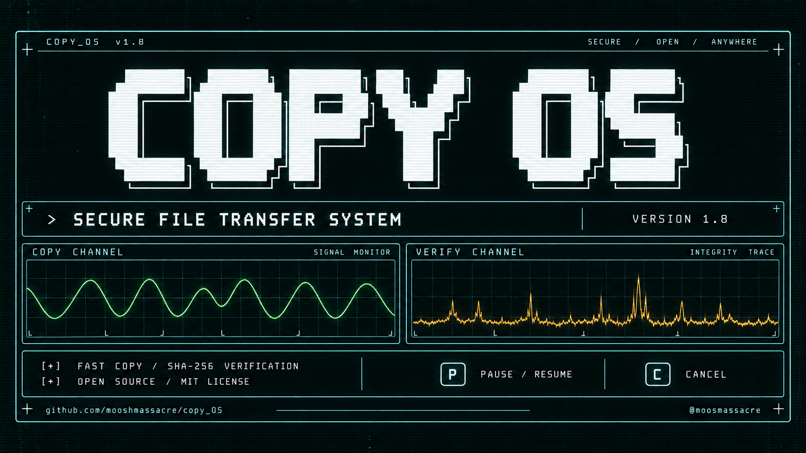

# COPY_OS 1.8



A Python file-copy and NAS backup utility with fast and SHA-256-verified copy modes. Version 1.8 is the current release.

Copyright (c) 2026 @moosmassacre <mooshmassacre@mail.com>. Licensed under the MIT License; see LICENSE.

## Requirements and startup

Python 3.9 or later. No additional packages are required. Use a terminal with ANSI support. Keep `copy_OS.py` and `config.json` in the same directory.

### Windows — double-click launcher

1. Install Python 3.9+ with its launcher or PATH option.
2. [Download the current project ZIP](https://github.com/mooshmassacre/copy_OS/archive/refs/heads/main.zip) and extract it.
3. Double-click **start_copy_OS.bat** in the extracted folder.

Keep the BAT file, `copy_OS.py` and `config.json` together. The launcher detects Python and runs from the project folder, where logs and reports will be saved. The original v1.8.0 release ZIP does not include this launcher.

See the [Windows user guide](docs/WINDOWS_GUIDE.md) for setup, controls and troubleshooting.

Optional terminal command:

```powershell
python copy_OS.py
```

macOS / Linux:

```sh
python3 copy_OS.py
```

Enter the source folder, destination folder, execution mode and copy mode when prompted. The insufficient-space confirmation uses **Y** for yes. Backup profiles are not used.

## Copy modes

Both modes decide whether to copy using size and modification time. Files already considered up to date are skipped without hashing.

- **Fast:** copies to a `.copying` temporary file, checks the copied size and detects source changes. No SHA-256 or per-file `fsync()`.
- **Secure:** additionally calculates the source SHA-256 during transfer, flushes with `fsync()`, hashes the temporary file and compares the results before replacing the destination.
- **Dry Run:** reports what would be copied without writing destination files. Logs and reports are still created.

Each attempt reads the current source size. A source change after the initial scan does not cause endless retries against an obsolete size. Changes detected during copying or before replacement still reject that attempt.

Existing destination files are replaced only after successful checks. Destination-only files are not deleted.

## Keyboard controls

With the terminal focused, press **P** to pause/resume or **C** to cancel, without Enter. Ctrl+C also cancels.

Controls are available during scanning, space checks, copying, temporary-file verification and retry waits. During copying or hashing, a blocked operating-system read/write must return before the command can be handled. Pausing does not freeze other applications: source changes remain subject to validation.

Cancellation preserves completed files and attempts to remove the current temporary file. Cleanup errors are logged.

## Responsive startup

The source scan shows the current path, file count, accumulated size and waiting time. It stops after 30 seconds without progress. Source read errors stop the operation before copying a partial file list. Directory junctions/reparse points encountered during traversal are reported rather than followed.

The destination free-space query waits up to 5 seconds. If it fails or times out, the program warns and continues without a free-space estimate. A requested pause is excluded from these waiting limits. Background queries do not write destination files; cancelling their wait cannot forcibly interrupt a blocked operating-system query.

The space warning compares available space against the entire source size, so it may overestimate incremental-copy requirements.

## Configuration

The script reads `config.json` next to itself, regardless of the current working directory. If absent, built-in defaults apply. **Replace the earlier Portuguese-key configuration with the supplied English-key file.** Unknown or old keys produce an error before copying; they are not silently ignored.

```json
{
  "max_attempts": 5,
  "retry_delay_seconds": 10,
  "additional_extensions": [],
  "additional_names": []
}
```

| Key | Meaning |
|---|---|
| `max_attempts` | Total attempts per file, including the first; integer 1–1000. Default: 5. |
| `retry_delay_seconds` | Delay between attempts; integer 0–3600. Default: 10. |
| `additional_extensions` | Extra excluded suffixes, such as `.bak`. |
| `additional_names` | Extra exact file/directory names, such as `Cache`, at any depth. |

Exclusions are case-insensitive and additive. Built-in exclusions, including `.DS_Store`, all `._` names and common temporary/system files, remain enabled. Use simple suffixes/names, not paths or wildcard expressions. For `archive.tar.gz`, the suffix is `.gz`.

JSON does not allow comments or trailing commas. Duplicate/unknown keys and invalid values stop startup. Restart the program after editing the file. Effective settings are recorded in the log.

## Statistics and performance

The terminal normally redraws up to five times per second. Errors, final results and manual resume trigger immediate updates. Existing-file decisions use one destination metadata lookup instead of a separate existence check followed by another lookup. The copy block remains 8 MiB.

Transfer speed uses transferred bytes and active copy time, including source hashing and flush. It excludes skipped bytes, pause time, retry waits and temporary-file verification. Retry traffic is counted in transferred bytes; successfully copied bytes count completed files once. System and NAS caches affect measured speed.

ETA estimates copying only, excluding future retries and verification. Pending bytes are adjusted as up-to-date files are skipped. Overall progress means processing, not successful copying: check the failure count.

## Logs and error reports

The current working directory receives a `logs` folder containing timestamped logs and `backup_..._report.txt` summaries.

Final results are **COMPLETED**, **COMPLETED WITH FAILURES**, **DRY RUN COMPLETED**, **CANCELLED**, or **STOPPED WITH ERROR**.

Reports list affected paths, stages, reasons, attempts and operating-system error codes when available. Categories include access denied, disk full, file in use, source changes, integrity failures and network errors/timeouts. Unrecognized errors retain their original description. Recovered attempts appear in the detailed log and attempt count, without marking a successful file as a permanent failure.

If report writing fails, the summary is printed in the terminal. Filenames, user-entered paths and operating-system exception messages are preserved verbatim; their language depends on the user and operating system.

## Validation checklist

1. Run Dry Run on a small sample; confirm no destination files are created.
2. Test additional exclusions using a `.bak` file and a `Cache` folder.
3. Pause/resume and cancel during source scanning.
4. Copy a large test file in fast mode; pause/resume, then verify its contents.
5. Repeat in secure mode and exercise the controls during verification.
6. Cancel an update before replacement; confirm that the old destination survives.
7. Review the log and final report, including any failures.
8. Compare throughput on your actual Windows/NAS setup.

Local automated tests cover both modes, configuration, retries, corruption rejection, source changes, pause/cancellation, blocked scans and final reports. The user confirmed successful execution on macOS. Windows keyboard input was simulated; real Windows/NAS validation remains pending. Local block-size measurements are not proof of a network speed improvement.

## Release 1.8

- English interface, source code, configuration and documentation.
- Pause/resume and cancellation during supported operations.
- Live source scanning with timeout and bounded free-space queries.
- Configurable exclusions and retry limits in `config.json`.
- Detailed final reports with failure categories and affected paths.
- Throttled terminal redraws and fewer destination metadata queries.

`copy_OS.py` is the current entry point. Earlier versions remain available through Git history and version tags.

## Roadmap

### Implemented

- [x] Dry Run processed-byte correction (1.6).
- [x] Expanded transfer statistics (1.7).
- [x] Pause/resume and cancellation (1.8).
- [x] Responsive scanning and bounded free-space queries (1.8).
- [x] Configuration for exclusions and retry settings (1.8).
- [x] Detailed error reports (1.8).
- [x] Terminal redraw and metadata-query optimizations (1.8).
- [x] English translation (1.8).

### Next steps

- [ ] Validate controls and startup on real Windows/NAS setups in both modes.
- [ ] Measure and improve NAS/network performance further.
- [ ] Improve recovery of interrupted transfers.
- [ ] Expand verification options.
- [ ] Graphical interface.

See [PERFORMANCE.md](PERFORMANCE.md) for local measurements and their limits.
